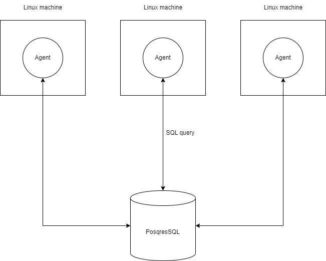
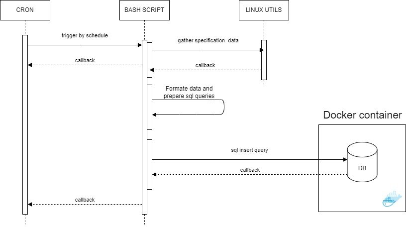

# Linux Cluster Monitoring Agent

## Introduction

### Purpose

The purpose of the monitoring agent is to collect hardware and OS specifications from Linux machines for future analysis.

### Simplified workflow

The work of this agent consists of running a few bash scripts triggered by CRON scheduled jobs to gather system data. This data is then used to generate SQL statements to push it into a relational database running in a Docker container.  
There are two tables in the database containing hardware and OS specifications data.
A bash script has been created to facilitate the maintenance of the PostgreSQL container. It provides the user with capabilities to create, start or stop containers.

### Used Technologies

Bash, Docker, PostgreSQL

## Architecture
### Cluster diagram

### Sequence diagram

## Implementation steps
I began by setting up a Docker container with PostgreSQL. Once the database was configured correctly and ready for use, I started preparing scripts to collect hardware and OS specification data, utilizing various Linux utilities for gathering information like hostname, lscpu, MemTotal, date, vmstat, and df. And a few utilities to format data like awk, grep, head, tail, tr;
Then based on the gathered information, a DB was created with two tables. The next step involved preparing scripts for inserting the collected data into the DB using SQL queries. Finally, the agent was made ready by scheduling script triggering through CRON jobs.

## Improvements
- Add extra logging and store it in a text file;
- Create a bash script to modify CRON jobs more conveniently;
- Create a backup database;

## Scripts
Docker container management script has a name psql_docker.sh and following parameters action(create|start|stop), DB username and DB password.
