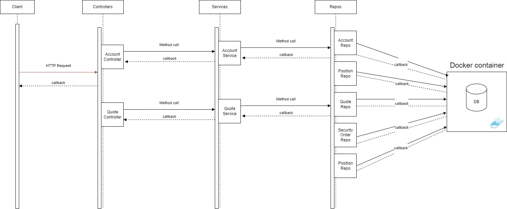

# Introduction
The Trade project is a Java based Spring Boot application that allows users to interact with the trading market, specifically with shares through REST API. The app stores information on selected shares in the PSQL database, and Swagger was configured to make the interaction with API more convenient. Additionally, the application was dockerized to enhance its portability.

# Implementation
## Diagram

In order to implement this project, the code-first approach was used, which involved the creation of DTO classes and then a DB relational scheme corresponding to the OOP application model. Spring Boot JPA module with Hibernate as an ORM was used to achieve this. Mapping configuration was implemented using various annotations such as Entity, Table, Column, etc.

The controllers were configured using Spring annotations as well, which provided impressive clarity on what method could be mapped to what method. A Service level was implemented as a linking bond between the controller and persistent levels, mainly responsible for business logic.

# Test
Throughout the development process, a TDD approach was utilized to ensure that the system remained operational during all development and additionally improved test coverage. Two types of tests were implemented: unit tests using Junit5 to verify single modules functionality and integrational, using WireMock and Spring Boot test module.

# Improvements
1)	Add a frontend interface.
2)	Add a CI/CD pipeline.
3)	Add CRON expressions support.

